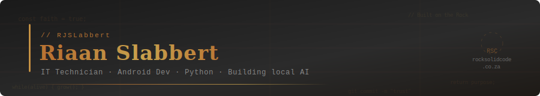

<div align="center">
  
</div>

<br/>

```kotlin
// Who I am
val riaan = Developer(
    role     = "IT Technician → Software Developer",
    location = "Johannesburg, ZA",
    focus    = listOf("Android", "Python", "Local AI", "Web Systems")
)
```

<br/>

## `// What I build`

I'm an IT Technician with hands-on experience building Android apps, web systems, and local AI projects. I work with real hardware, real problems, and real code — picking up industry experience one project at a time.

Currently working toward system architecture and cloud, with an eye on Japan.

<br/>

## `// Stack`

<div align="left">


</div>

<br/>

## `// Currently building`

| Project | What | Status |
|---|---|---|
| 🐉 **Ryuu** | Local AI assistant on Raspberry Pi 5 | In progress |
| 📋 **Daily Discipline Tracker** | Android productivity app | Live & in use |
| 🌐 **Rock Solid Code** | Faith + tech blog & portfolio | Live |
| ☁️ **AWS Cloud Practitioner** | Certification | Studying |

<br/>

## `// Find me`

<div align="left">

[](https://rocksolidcode.co.za)
[](https://www.linkedin.com/in/riaan-slabbert-45346b228)

</div>

<br/>

<div align="center">
  <sub><code>// Building systems that matter, one commit at a time.</code></sub>
</div>
